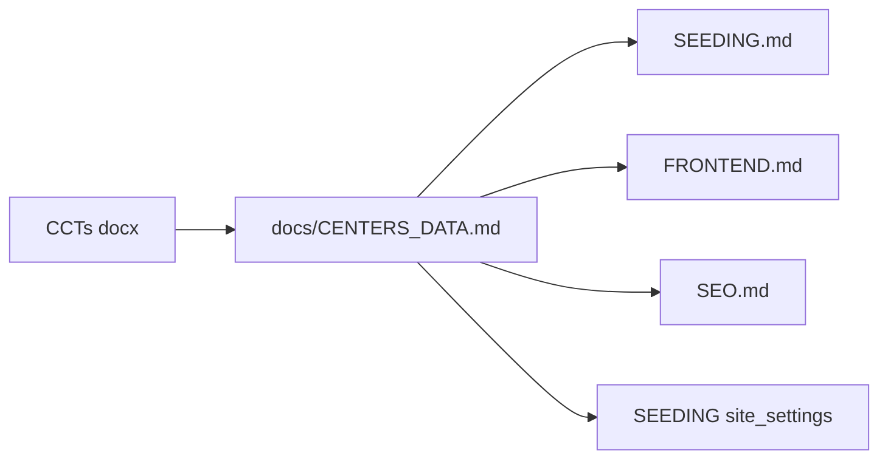

# Documentation update from CCTs of NACHO

## Source material

Primary input: [`CCTs of NACHO.docx`](/Users/admin/NACHO-site/CCTs%20of%20NACHO.docx) (center contact sheet). The attached image did not carry usable content; the **official logo is already integrated** in code per [CHANGELOG.md](CHANGELOG.md) — no logo doc change required unless you supply a new asset.

### Verified facts from the docx

| Role | Name | Location | Status |
|------|------|----------|--------|
| Operational | NACHO Yaounde 1 | Mendong market, Yaounde | Open |
| Operational | NACHO Nkwen-Bamenda | NTEFINKI Quarter mile 6 Nkwen | Open |
| Operational | NACHO Nacho-Bamenda | Atuakum Mankon | Open |
| Under construction | NACHO Douala | — | Coming soon |
| Under construction | NACHO Kumba | — | Coming soon |
| **HQ (not a 6th center)** | Main Headquarter | Atuakum Mankon; P.O. Box 100 Bamenda | Corporate contact |

**Conflict with current docs:** [docs/SEEDING.md](docs/SEEDING.md) §6 still lists three **wrong** operational centers (Douala ×2, Yaounde ×1) and under-construction Bafoussam/Garoua. Only the **3+2 count** is correct; **cities and contact data must be replaced**.

**User decision:** Keep **"Opening before October 2026"** for under-construction centers (not docx-only "coming soon").

---

## Recommended doc changes (by file)

### 1. New canonical reference — `docs/CENTERS_DATA.md`

Create a **single source of truth** for verified center + HQ data (extracted from the docx). Include per center:

- `slug`, display name, city, region (administrative)
- phones (normalized), email
- address, `nearby_landmark` where applicable
- `latitude`, `longitude`
- `opening_hours` structure (Yaounde has weekday vs Saturday/holiday split; Bamenda centers Mon–Sat 08:00–16:00)
- `status`: `operational` | `under_construction`
- Under-construction copy: EN/FR per [CONTENT_GUIDELINES.md](docs/CONTENT_GUIDELINES.md)

Proposed slugs (English paths, locked decision):

| Slug | Center |
|------|--------|
| `nacho-yaounde-1` | NACHO Yaounde 1 |
| `nacho-nkwen-bamenda` | NACHO Nkwen-Bamenda |
| `nacho-mankon-bamenda` | NACHO Nacho-Bamenda |
| `nacho-douala` | NACHO Douala |
| `nacho-kumba` | NACHO Kumba |

HQ block (separate): email `nachovehicletestingstation@yahoo.com`, phones `+237 675 615 478`, `656 901 833`, `677 789 391`, address Atuakum Mankon, P.O. Box 100 Bamenda — used for **site_settings** and contact/footer, not counted in the “5 centers” table.

Optional: add `docs/sources/README.md` noting the docx path and extraction date.

---

### 2. [docs/SEEDING.md](docs/SEEDING.md) — **high priority**

Replace §6 placeholder table with rows aligned to `CENTERS_DATA.md`:

- Remove: `douala-1`, `douala-2`, `bafoussam`, `garoua`
- Add: real slugs, GPS, emails, landmarks (e.g. Mendong market; NTEFINKI Quarter mile 6; Atuakum Mankon)
- Note: `vehicle_categories_fr/en` remain **generic placeholders** until NACHO supplies per-center lists
- Update §9 **site_settings** defaults: HQ phone/email/address from docx (replace generic placeholders)
- Add cross-link: “Authoritative data: [CENTERS_DATA.md](CENTERS_DATA.md)”

---

### 3. [docs/FRONTEND.md](docs/FRONTEND.md)

- **Centers §:** Reference `CENTERS_DATA.md` for static Steps 8 and seed Step 20
- **Homepage §4 (center status preview):** Example cards should name Yaounde + Bamenda (not Douala operational)
- Clarify HQ appears on Contact/footer, not in the 5-center status grid

---

### 4. [docs/CONTENT_GUIDELINES.md](docs/CONTENT_GUIDELINES.md)

- §1: Add explicit geography note — operational network is **Yaounde + Bamenda (2 sites)**; expansion is **Douala + Kumba** (not Bafoussam/Garoua)
- Keep October 2026 wording (confirmed)

---

### 5. [docs/SEO.md](docs/SEO.md)

- §8 keywords: add **Bamenda**, **Kumba**, **Northwest/Southwest** where relevant; keep Douala/Yaoundé as future/expansion terms
- Center slug examples: use `nacho-nkwen-bamenda` style slugs

---

### 6. [docs/DATABASE.md](docs/DATABASE.md)

- Update center name example from “NACHO Douala 1” to “NACHO Yaounde 1”
- Document `opening_hours` JSON shape for **split schedules** (Yaounde weekday vs Saturday/holiday) in §3.3

---

### 7. [docs/ROADMAP.md](docs/ROADMAP.md) + [plan.md](plan.md)

- **Outstanding inputs:** Mark center names/addresses/phones/GPS as **partially supplied** (docx); still pending: photos, per-center vehicle categories, legal text, certifications
- Steps 8 and 20: note dependency on `CENTERS_DATA.md`

---

### 8. [README.md](README.md)

- One line under status or documentation index linking to `docs/CENTERS_DATA.md`
- Optional: note verified data source file `CCTs of NACHO.docx` in repo root

---

### 9. [docs/PROJECT_BRIEF.md](docs/PROJECT_BRIEF.md) + [docs/UAT_CHECKLIST.md](docs/UAT_CHECKLIST.md) + [docs/MAINTENANCE.md](docs/MAINTENANCE.md)

- **PROJECT_BRIEF:** If geographic scope is mentioned, align with Cameroon network (Centre + Northwest operational; Littoral/Southwest upcoming)
- **UAT:** Checklist item — verify center cards match `CENTERS_DATA.md` (not old placeholders)
- **MAINTENANCE:** Replace “confirm placeholder centers” with pointer to `CENTERS_DATA.md` for updates

---

### 10. [CHANGELOG.md](CHANGELOG.md) + master plan

- [CHANGELOG.md](CHANGELOG.md): Unreleased entry — “Docs: verified center data from CCTs of NACHO.docx”
- [.cursor/plans/nacho_master_implementation_c01132ca.plan.md](.cursor/plans/nacho_master_implementation_c01132ca.plan.md): Under Proposal alignment, mark center data as **sourced**; link `CENTERS_DATA.md`

---

## Docs that need **no** change (for this input)

| Doc | Reason |
|-----|--------|
| ADRs 001–006 | Stack/i18n/roles unchanged |
| BRAND.md | Logo already in app; palette unchanged |
| ROLES.md, ADMIN_MODULES.md, SECURITY.md, TESTING.md | Unaffected by center sheet |
| DEPLOYMENT.md, I18N.md | No center-specific deltas |
| Tariff tables in SEEDING | Docx has no tariff rows |

---

## Implementation timing (when docs are edited)

| Build step | Use updated docs for |
|------------|----------------------|
| **Step 6** (homepage) | Static center preview copy — real city names |
| **Step 8** (centers static) | Hardcode from `CENTERS_DATA.md` |
| **Step 14** (contact) | HQ phones/email/address |
| **Step 20** (seeders) | Full center + settings seed |
| **Step 28** (admin centers) | Validation against same source |

No database migration required beyond fields already planned (`nearby_landmark`, `opening_hours`, etc.).

---

## Execution order (when you approve)

1. Create `docs/CENTERS_DATA.md` with full structured data from docx
2. Update `SEEDING.md`, `CONTENT_GUIDELINES.md`, `FRONTEND.md`
3. Update `SEO.md`, `DATABASE.md`, `ROADMAP.md`, `README.md`, `plan.md`
4. Touch `PROJECT_BRIEF`, `UAT_CHECKLIST`, `MAINTENANCE`, `CHANGELOG`, master plan
5. Do **not** change seeders/Blade until Step 8/20 unless you explicitly request code in the same pass
