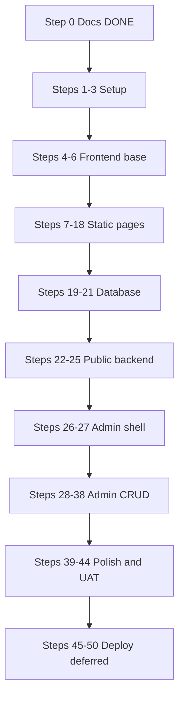

# NACHO Vehicle Inspection — Chronological Master Plan

## Current state

[`/Users/admin/NACHO-site`](/Users/admin/NACHO-site) contains **documentation only** (27 markdown files). **Step 0 is complete.** No Laravel code exists yet.

Reference docs: [`docs/ROADMAP.md`](docs/ROADMAP.md), [`docs/FRONTEND.md`](docs/FRONTEND.md), [`docs/DATABASE.md`](docs/DATABASE.md), [`docs/ARCHITECTURE.md`](docs/ARCHITECTURE.md), [`docs/ADMIN_MODULES.md`](docs/ADMIN_MODULES.md).

## Delivery model

- **Strict chronological order** — Step N is never started until Step N−1 is approved.
- **One step = one approval phase** — say **"do Phase 7"** (or **"do Step 7"** — same number) to start that step only.
- Each phase ends with: smoke test, [`CHANGELOG.md`](CHANGELOG.md) entry, [`docs/ROADMAP.md`](docs/ROADMAP.md) update.
- **Excluded forever in v1:** reminders, expiry tracking, customer portal, fleet/corporate, equipment integration.

## Master timeline (50 steps)

---

## Step 0 — Documentation (DONE)

| Step | Task | Spec |
|------|------|------|
| 0 | Project identity, brand, scope, all docs + ADRs | §2 |

---

## Steps 1–3 — Project creation

| Phase / Step | Task | Spec | Exit |
|:--:|------|------|------|
| **1** | Prepare local dev environment (PHP, Composer, Node, MySQL `nacho_vehicle_inspection`) | §3.2 | DB exists; [ENVIRONMENT.md](docs/ENVIRONMENT.md) |
| **2** | Create Laravel project; preserve docs; init git | §3.2 | `php artisan serve` works |
| **3** | Visual identity: Tailwind `nacho-*` tokens, Breeze, base CSS | §4.1 | [BRAND.md](docs/BRAND.md) in code |

---

## Steps 4–6 — Frontend foundation

| Phase / Step | Task | Spec | Exit |
|:--:|------|------|------|
| **4** | Public layout: contact bar, nav (proposal §7 order), logo, `FR \| EN` switcher, mobile menu, footer | §4.2, §7 | `layouts/public.blade.php` |
| **5** | Reusable components: hero (+ slogan tagline), cards, tables, forms shell, alert, breadcrumb, CTA, pagination | §4.4, §3 | `components/public/*` |
| **6** | Homepage — 14 sections per [DESIGN.md](docs/DESIGN.md) (split hero, 6-step timeline, technical checks, result cards, footer CTA) | §4–§10 design spec | `/` complete |

---

## Steps 7–18 — Static public pages (one page per step)

Built as **static Blade** first; wired to DB at Step 22. Content rules: 3 operational + 2 under-construction centers ([CONTENT_GUIDELINES.md](docs/CONTENT_GUIDELINES.md)).

| Phase / Step | Task | Spec | Route |
|:--:|------|------|-------|
| **7** | About page | §5.1 | `/about` |
| **8** | Centers — Dynamic Center Finder (4 blocks, index-only, lazy map) | [DESIGN.md](docs/DESIGN.md) §11, [FRONTEND.md](docs/FRONTEND.md) | `/centers` |
| **9** | Services index | §5.3 | `/services` |
| **10** | Service detail pages (×5) with full inspection-point copy per §10.1–10.5 | §5.4–5.8 | `/services/{slug}` (English slugs) |
| **11** | Tariffs — Master Pricing Console (4 blocks, mobile UX) | [DESIGN.md](docs/DESIGN.md), [FRONTEND.md](docs/FRONTEND.md) | `/tariffs` |
| **12** | Inspection process — 6-step timeline + Accepted/Suspended/Refused | §5.10, §14, [DESIGN.md](docs/DESIGN.md) | `/inspection-process` |
| **13** | Booking form **UI only** | §5.11 | `/book-inspection` |
| **14** | Contact page (form UI + map + optional WhatsApp click-to-chat placeholder) | §5.15, §19 | `/contact` |
| **15** | Blog / road-safety education — index + detail; 10 topic titles as placeholders | §5.12, §16 | `/blog`, `/blog/{slug}` |
| **16** | Careers index + detail + apply form UI | §5.14 | `/careers`, `/careers/{slug}` |
| **17** | Compliance & quality page | §5.13 | `/compliance-quality` |
| **18** | Legal pages (privacy, terms, cookies, legal notice) | §5.16 | `/privacy-policy`, etc. |

*Previously step 16 bundled careers + compliance + legal; now split into Steps 16–18.*

---

## Steps 19–21 — Database layer

| Phase / Step | Task | Spec | Exit |
|:--:|------|------|------|
| **19** | Migrations: core tables + `tariff_revisions` + `center_contacts` + `center_hours` + `center_progress_updates`; expanded `tariffs` and `centers` + `center_service` pivot | [DATABASE.md](docs/DATABASE.md), ADR 007–008 | Migrations ready |
| **20** | Seed data: roles, admin, services, 7 tariffs, centers (contacts, hours, pivot), blog topics, legal, settings | [SEEDING.md](docs/SEEDING.md) | `migrate:fresh --seed` OK |
| **21** | Models, relationships, enums, factories | §7.4 | `migrate:fresh --seed` OK |

Bookings table: **no** reminder/expiry columns.

---

## Steps 22–25 — Public backend (one concern per step)

| Phase / Step | Task | Spec | Exit |
|:--:|------|------|------|
| **22** | Public controllers: replace static placeholders with DB content; `CenterFinderService`, `TariffService` | §7.2 | Dynamic centers finder, services, blog, careers, legal |
| **23** | Booking backend: validation, `BookingReferenceService`, persistence, confirmation | §5.11 | Reference shown; no reminder fields |
| **24** | Contact backend: validation, storage, staff email | §5.15 | Messages in admin |
| **25** | Career application backend: validation, CV upload, staff email | §5.14 | Applications linked to posts |

Baseline security on all forms: CSRF, honeypot, throttle, upload rules ([SECURITY.md](docs/SECURITY.md)).

---

## Steps 26–27 — Admin shell

| Phase / Step | Task | Spec | Exit |
|:--:|------|------|------|
| **26** | Admin authentication + custom roles middleware | §7.6–7.7 | [ROLES.md](docs/ROLES.md) enforced |
| **27** | Admin layout + dashboard summary cards | §8.1–8.2 | 11 stat cards live |

---

## Steps 28–38 — Admin CRUD (one module per step)

| Phase / Step | Task | Spec |
|:--:|------|------|
| **28** | Center management | §8.3 |
| **29** | Service management | §8.4 |
| **30** | Tariff management + revisions + audit log | §8.5, ADR 006–007 |
| **31** | Booking management | §8.6 |
| **32** | Contact message management | §8.7 |
| **33** | Blog categories + posts | §8.8 |
| **34** | Careers + applications | §8.9 |
| **35** | Page management (legal/static) | §8.10 |
| **36** | Media library | §8.11 |
| **37** | User + role management (Super Admin) | §8.12 |
| **38** | Site settings | §8.13 |

---

## Steps 39–44 — Polish and local sign-off

| Phase / Step | Task | Spec |
|:--:|------|------|
| **39** | Multilingual: lang files, FR/EN accessors, session switcher | §9 |
| **40** | SEO: titles, meta, OG, JSON-LD, sitemap, robots | §10 |
| **41** | Security hardening: maintenance mode, cookie banner, prod checklist | §11 |
| **42** | Frontend testing pass | §12.1 |
| **43** | Backend + database + form + security testing pass | §12.2–12.5 |
| **44** | Bug fixes + UAT sign-off ([UAT_CHECKLIST.md](docs/UAT_CHECKLIST.md)) | §14 |

---

## Steps 45–50 — Deployment (DEFERRED until Step 44 sign-off)

| Phase / Step | Task | Spec |
|:--:|------|------|
| **45** | Final local stabilization gate | §14 |
| **46** | Dockerize (Laravel + Nginx + MySQL) | §15 |
| **47** | Deploy on VPS | §16 |
| **48** | SSL, backups, monitoring, error logging | §16 |
| **49** | Final production testing | §16 |
| **50** | Launch + sitemap submission + Google Search Console (+ optional analytics) | §16, §17, §19 | Live site indexed |

See [DEPLOYMENT.md](docs/DEPLOYMENT.md). Deploy steps run one at a time when you reach production.

---

## Quick reference — all phases at a glance

| Phase | Step | Name |
|:-----:|:----:|------|
| — | 0 | Documentation (**done**) |
| 1 | 1 | Local environment |
| 2 | 2 | Laravel project |
| 3 | 3 | Visual identity |
| 4 | 4 | Public layout |
| 5 | 5 | Components library |
| 6 | 6 | Homepage (static) |
| 7 | 7 | About (static) |
| 8 | 8 | Centers — Dynamic Center Finder |
| 9 | 9 | Services index (static) |
| 10 | 10 | Service details (static) |
| 11 | 11 | Tariffs — Pricing Console |
| 12 | 12 | Inspection process (static) |
| 13 | 13 | Booking UI (static) |
| 14 | 14 | Contact (static) |
| 15 | 15 | Blog (static) |
| 16 | 16 | Careers (static) |
| 17 | 17 | Compliance (static) |
| 18 | 18 | Legal pages (static) |
| 19 | 19 | Migrations |
| 20 | 20 | Seeders |
| 21 | 21 | Models + factories |
| 22 | 22 | Wire public controllers |
| 23 | 23 | Booking backend |
| 24 | 24 | Contact backend |
| 25 | 25 | Career backend |
| 26 | 26 | Admin auth + roles |
| 27 | 27 | Admin dashboard |
| 28 | 28 | Admin: centers |
| 29 | 29 | Admin: services |
| 30 | 30 | Admin: tariffs |
| 31 | 31 | Admin: bookings |
| 32 | 32 | Admin: contact |
| 33 | 33 | Admin: blog |
| 34 | 34 | Admin: careers |
| 35 | 35 | Admin: pages |
| 36 | 36 | Admin: media |
| 37 | 37 | Admin: users |
| 38 | 38 | Admin: settings |
| 39 | 39 | i18n |
| 40 | 40 | SEO |
| 41 | 41 | Security |
| 42 | 42 | Frontend tests |
| 43 | 43 | Backend tests |
| 44 | 44 | UAT sign-off |
| 45–50 | 45–50 | Deploy (**deferred**) |

Say **"do Phase N"** or **"do Step N"** — same number.

---

## Mapping to original spec §19 (47 steps)

Your spec used 47 build steps; this plan expands to **50** where splits add clarity:

| Spec §19 (approx.) | This plan |
|--------------------|-----------|
| Steps 1–2 (docs + env) | Step 0 (docs done) + Steps 1–2 |
| Step 3 (Laravel) | Step 2 |
| Step 4 (visual identity) | Step 3 |
| Steps 5–6 (layout + homepage) | Steps 4–6 (+ components as Step 5) |
| Steps 7–16 (static pages) | Steps 7–18 (careers/compliance/legal split) |
| Steps 17–19 (database) | Steps 19–21 |
| Steps 20–21 (models + controllers) | Steps 21–22 |
| Booking/contact/careers backend | Steps 23–25 (split) |
| Steps 22–24 (admin auth/layout/dashboard) | Steps 26–27 |
| Steps 25–34 (admin CRUD) | Steps 28–38 (one module each) |
| Steps 35–36 (i18n + SEO) | Steps 39–40 |
| Steps 37–41 (testing) | Steps 41–44 (security + test passes + UAT) |
| Steps 42–47 (deploy) | Steps 45–50 |

---

## Why frontend before database?

Spec §4 and §19: design frontend structure before backend logic.

1. **Steps 4–18** — static UI; review each page before DB exists.
2. **Steps 19–21** — database.
3. **Steps 22–25** — wire data and forms.

---

## Locked decisions and enhancements

| Topic | Decision | Notes |
|-------|----------|-------|
| Stack | Laravel, Blade, **Tailwind** (not Bootstrap), Vite, Breeze | ADR 001 |
| Database | MySQL `nacho_vehicle_inspection` | ADR 004 |
| i18n | Session locale, FR default, single URLs | ADR 002 |
| **URL paths** | **English paths** — `/centers` (index-only finder), English service slugs (`periodic-inspection`, etc.) | User confirmed; French keyword slugs from proposal §18 deferred |
| Roles | 6 roles (Super Admin → Content Manager) | [ROLES.md](docs/ROLES.md) |
| Booking statuses | 8 values: pending → confirmed → arrived → in_inspection → completed; plus cancelled, no_show, rescheduled | Proposal §12.3 |
| Reminders / fleet | Excluded; separate SMS/WhatsApp system stays independent | Proposal §1, §23 |

Enhancements (documented): staff email on submissions, honeypot/throttle, booking ref `NACHO-YYYYMMDD-XXXX`, tariff audit log, soft deletes, WCAG AA, PHPUnit, SEO hreflang limitation note.

---

## Proposal alignment (unified spec)

Cross-check against the updated unified proposal. **Already aligned** — no plan change needed:

- Brand positioning, 3+2 center rule, slogans (EN/FR in [PROJECT_BRIEF.md](docs/PROJECT_BRIEF.md))
- Burnt orange + charcoal palette ([BRAND.md](docs/BRAND.md))
- All 15 public pages + admin dashboard scope
- Homepage hero copy, trust strip, 5 services, inspection journey, final CTA
- Booking form fields and excluded reminder fields
- Master Pricing Console tariff rows (7 categories with `category_slug`) and safe regulatory notice text (FR/EN)
- Compliance safe wording when credentials unconfirmed
- Bilingual FR default; blog as road-safety education
- Local-first → Docker/VPS deferred deploy strategy

**Adjustments to apply** (doc updates at Phase 1 start; implementation in relevant steps):

| Area | Proposal source | Adjustment | Affected step(s) |
|------|-----------------|------------|------------------|
| **URLs** | §18 French slugs | **Keep English paths** (user choice). SEO targets French keywords via `seo_title_fr`, meta descriptions, and page content — not URL segments. | 4, 8–10, 40 |
| **Slogan in UI** | §3 | Show slogan in hero tagline and JSON-LD: *Drive Safe. Stay Compliant. Trust NACHO.* / FR equivalent | 6, 40 |
| **Homepage content audit** | §8 | Step 6 exit criteria: homepage must answer who / what / where / why / next (five questions) | 6 |
| **Nav order** | §7 | Main nav order: Home → About → Centers → Services → **Book** → Tariffs → Process → Blog → Compliance → Careers → Contact; Book stays highlighted CTA | 4 |
| **Center finder** | Centers spec | **Dynamic Center Finder** — 4 blocks, normalized contacts/hours, service filter, lazy map, index-only | 8, 19, 20, 22, 28 |
| **Tariff console** | Pricing spec | **Master Pricing Console** — split-screen, safe regulatory copy, `category_slug`, `tariff_revisions`, logistics via settings | 11, 19, 20, 30, 23 |
| **Inspection process** | §14, DESIGN | Use **6 steps** on homepage and process page (book → register → machine → visual → validation → report/PV) | 6, 12 |
| **Service page depth** | §10.1–10.5 | Step 10 static copy must include full inspection-point lists (periodic, heavy vehicle, pre-purchase, road safety topics) per proposal | 10 |
| **Blog topics** | §16 | Seed or document **10 recommended article titles** as placeholder posts or admin content backlog | 15, 20 |
| **WhatsApp contact** | §19 | Optional click-to-chat on contact page + footer via `whatsapp_contact` setting (general contact only — not reminders) | 14, 38 |
| **Post-deploy SEO** | §19, §22 | Step 50: Google Search Console + privacy-friendly analytics (optional GA); Cloudflare optional | 50 |
| **ROADMAP sync** | §22 | ~~Replace old 11-phase [ROADMAP.md](docs/ROADMAP.md)~~ **Done** — see also [plan.md](plan.md) | — |

**Intentionally kept beyond proposal minimum:**

- Homepage **14 sections** per [DESIGN.md](docs/DESIGN.md) (premium platform UX — split hero, technical checks, result cards, footer CTA band, floating book button)
- **Tailwind** over Bootstrap — already locked in ADR 001
- **Media library** admin module — supports center photos and blog images

---

## Critical content rules

- 3 operational + 2 under construction (before Oct 2026)
- Safe tariff notice on tariffs page (effective/last-verified dates when available — no unverified homologation claims)
- Safe compliance wording
- No reminder/expiry fields on booking

---

## Inputs needed from NACHO

Center names/addresses/phones/GPS partially supplied — [CENTERS_DATA.md](docs/CENTERS_DATA.md). Still pending: photos, per-center vehicle categories, Douala/Kumba final addresses, legal text, certifications. See [ROADMAP.md](docs/ROADMAP.md).

---

## Next action

Say **"do Phase 1"** to start local environment setup. [docs/ROADMAP.md](docs/ROADMAP.md) and [plan.md](plan.md) are synced to this 50-step plan.
