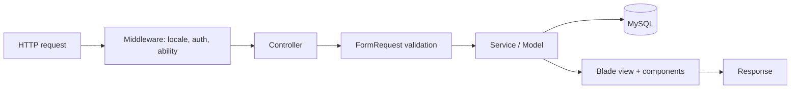

# Backend Architecture - NACHO Vehicle Inspection

Laravel full-stack, organized for clarity and separation of concerns.

## 1. Layered structure

```
app/
  Http/
    Controllers/
      Public/        # public website controllers
      Admin/         # admin dashboard controllers
    Requests/        # form request validation classes
    Middleware/      # locale, role/ability, maintenance
  Models/            # Eloquent models (one per table)
  Services/          # domain/business logic (e.g. BookingReferenceService)
  Support/           # helpers (e.g. AdminAccess ability helper)
  Enums/             # status enums (booking, center, etc.)
  Notifications/Mail # staff notifications (booking/contact/application)
database/
  migrations/        # one additive migration per table/change
  seeders/           # default data
  factories/         # model factories for tests
resources/
  views/
    layouts/         # public + admin layouts
    components/      # reusable Blade components
    public/          # public pages
    admin/           # admin pages
lang/
  fr/  en/           # translation files
routes/
  web.php            # public + admin + auth routes
```

## 2. Public controllers (spec 7.2)

One controller per public area:

- `HomeController`
- `AboutController` (or `PageController@about`)
- `CenterController` (index only — Dynamic Center Finder; no public `show`)
- `ServiceController` (index + show)
- `BookingController` (create + store)
- `TariffController` (index — Master Pricing Console)
- `InspectionProcessController`
- `BlogController` (index + show)
- `ComplianceController`
- `CareerController` (index only — email-based vacancies; no `show`, no `apply` store)
- `ContactController` (index + store)
- `PageController` (legal/static pages)
- `LanguageController` (switch locale)

## 3. Admin controllers (spec 7.3)

- `DashboardController`
- `CenterController`
- `ServiceController`
- `TariffController`
- `BookingController`
- `BlogCategoryController`
- `BlogPostController`
- `CareerPostController`
- `CareerDepartmentController` (optional)
- `ContactMessageController`
- `PageController`
- `UserController`
- `MediaController`
- `SiteSettingController`

Each supports the CRUD operations relevant to its module (see [ADMIN_MODULES.md](ADMIN_MODULES.md)).

## 4. Models (spec 7.4)

One model per core table: `User`, `Role`, `Center`, `CenterContact`, `CenterHour`, `CenterProgressUpdate`, `Service`, `Tariff`, `TariffRevision`, `Booking`, `ContactMessage`, `BlogCategory`, `BlogPost`, `CareerDepartment`, `CareerPost`, `Page`, `Media`, `SiteSetting` (+ `TariffAuditLog`). Each defines casts, fillables, relationships (per [DATABASE.md](DATABASE.md)), scopes (e.g. `active()`, `published()`, `bookable()`), and bilingual accessors with FR fallback.

## 5. Form request validation (spec 7.5)

Dedicated `FormRequest` classes for every public and admin form:

- Public: booking, contact.
- Admin: center, service, tariff, blog post, blog category, career post, career department, page, user, media upload, settings.

Rules enforce required fields, valid email/phone, allowed file types and max sizes, valid dates, existence of selected center/service/tariff, and accepted consent where required. Details in [SECURITY.md](SECURITY.md).

## 6. Services & support

- `BookingReferenceService` - generates unique `NACHO-YYYYMMDD-XXXX` references.
- `TariffService` - resolves active tariffs for the Pricing Console and booking preselect:
  - `resolveActiveTariffs()` — effective-date logic (ADR 007), returns rows with current `price_fcfa`
  - `resolveTariffForBooking($id|$slug)` — single tariff for booking form deep link
  - `resolveRevisionForTariff(Tariff $tariff)` — current revision as of today
- Used by `TariffController`, booking form, and admin preview.
- `CenterFinderService` - powers the Dynamic Center Finder:
  - `resolveForFinder($filters)` — active vs expansion groups, search/region/service filters, eager-loads contacts, hours, services
  - `mapPayload()` — marker data for lazy-loaded map (active vs expansion marker styles)
  - `resolveBySlug($slug)` — single center for booking preselect from `?center={slug}`
  - Optional `sortByDistance($lat, $lng)` — after opt-in geolocation
- Used by `CenterController@index`, booking form, and static Step 8 config bridge.
- `CareerVacancyService` - powers the email-based Careers page:
  - `resolveForCareersPage($filters)` — published/closing_soon vacancies, department/center/employment filters
  - `resolveBySlug($slug)` — single vacancy for `?vacancy=` deep link
  - `buildMailtoUrl(CareerPost $post)` — encodes subject/body per `reference` and bilingual templates
  - `buildGeneralApplicationMailto()` — from `site_settings.careers_general_application_email`
  - `deriveClosingSoon(CareerPost $post)` — label when deadline approaches
- Used by `CareerController@index` and admin mailto preview.
- `AdminAccess` (Support) - centralizes the permission matrix ([ROLES.md](ROLES.md)).
- `LocaleService` (optional) - locale helpers for views.
- Status enums for booking/center/etc. keep status strings consistent.

## 7. Middleware

- `SetLocaleFromSession` - applies the session locale (FR default) to every public request.
- `EnsureRole` / `EnsureAdminAbility` - role/ability gating for admin routes.
- `MaintenanceMode` (optional) - honors the `maintenance_mode` site setting for the public site while leaving admin reachable.

## 8. Notifications / mail (enhancement)

Transactional **staff** notifications only (not customer reminders):

- New booking -> email to `BOOKING_NOTIFICATION_EMAIL`.
- New contact message -> email to `CONTACT_NOTIFICATION_EMAIL`.

Local dev uses the `log` mail driver. Career applications are **not** submitted through the website (mailto only — ADR 009). This is explicitly NOT the excluded SMS/WhatsApp reminder system.

## 9. Routing

- Public routes use single clean URLs (no locale prefix); locale comes from session. See [I18N.md](I18N.md) and [SEO.md](SEO.md).
- `GET /language/{locale}` switches and redirects back.
- Admin routes live under `/admin`, behind auth + role/ability middleware.
- `GET /sitemap.xml` and `GET /robots.txt` for SEO.

## 10. Data flow (request lifecycle)



## 11. Conventions

- Thin controllers, validation in FormRequests, reusable logic in Services.
- Eloquent relationships and query scopes over raw queries.
- Blade components for all repeated UI ([FRONTEND.md](FRONTEND.md)).
- Additive migrations; seeders idempotent (`updateOrCreate`).
- Tests via PHPUnit with factories ([TESTING.md](TESTING.md)).
