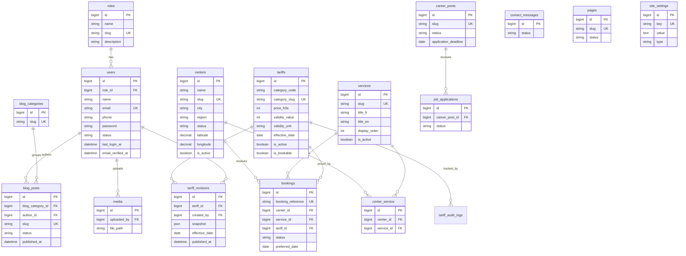

# Database Design - NACHO Vehicle Inspection

Database name: **`nacho_vehicle_inspection`** (MySQL, utf8mb4).

The schema is designed only for the confirmed scope. There are **no** reminder, expiry, fleet, customer-portal, or corporate tables.

## 1. Tables overview

Core spec tables (15):

1. `roles`
2. `users`
3. `centers`
4. `services`
5. `center_service`
6. `tariffs`
7. `bookings`
8. `contact_messages`
9. `blog_categories`
10. `blog_posts`
11. `career_posts`
12. `job_applications`
13. `pages`
14. `media`
15. `site_settings`

Plus Laravel framework tables (`password_reset_tokens`, `sessions`, `cache`, `jobs`, `failed_jobs`, etc.) and one enhancement table:

16. `tariff_revisions` - scheduled/regulatory price versions with effective dates (see ADR 007 in [adr/](adr/))
17. `tariff_audit_logs` - immutable admin edit history (see ADR 006 in [adr/](adr/) and [SECURITY.md](SECURITY.md))

## 2. Entity relationship diagram

## 3. Table specifications

Conventions: every table has `id` (bigint PK, auto-increment), `created_at`, and `updated_at` unless noted. Soft-deletable tables also have `deleted_at`. Bilingual fields use `_fr` / `_en` suffixes.

### 3.1 roles
- `name` (string)
- `slug` (string, unique) - e.g. `super-admin`, `admin`, `center-manager`, `receptionist`, `inspector`, `content-manager`
- `description` (string, nullable)

Default roles seeded: Super Admin, Admin, Center Manager, Receptionist, Inspector, Content Manager. See [ROLES.md](ROLES.md).

### 3.2 users
- `role_id` (FK -> roles, nullable on delete restrict/set null)
- `name` (string)
- `email` (string, unique)
- `phone` (string, nullable)
- `password` (string, hashed)
- `status` (enum-like string: `active`, `inactive`; default `active`)
- `last_login_at` (datetime, nullable)
- `email_verified_at` (datetime, nullable)
- `remember_token`

Relationships: a role has many users; a user belongs to one role.

### 3.3 centers
- `name` (string)
- `slug` (string, unique)
- `city` (string)
- `region` (string, nullable)
- `address` (text, nullable)
- `phone` (string, nullable)
- `email` (string, nullable)
- `opening_hours` (json or text, nullable) — structured schedules; see [CENTERS_DATA.md](CENTERS_DATA.md) for examples. **Simple:** one Mon–Sat block (Bamenda centers). **Split:** separate weekday vs Saturday/holiday blocks (Yaounde). Shape: `{ "timezone": "Africa/Douala", "schedules": [{ "label_fr", "label_en", "days": [], "open", "close", optional "note_fr"/"note_en" }] }`
- `status` (string: `operational`, `under_construction`; default `operational`)
- `description_fr` (text, nullable)
- `description_en` (text, nullable)
- `latitude` (decimal 10,7, nullable)
- `longitude` (decimal 10,7, nullable)
- `map_url` (string, nullable)
- `nearby_landmark` (string, nullable) - e.g. "Mendong market", "NTEFINKI Quarter mile 6 Nkwen"
- `vehicle_categories_fr` (text, nullable) - accepted vehicle types (French)
- `vehicle_categories_en` (text, nullable) - accepted vehicle types (English)
- `featured_image` (string, nullable)
- `is_active` (boolean, default true)
- soft deletes

Note: center name is treated as language-neutral (proper noun, e.g. "NACHO Yaounde"); bilingual narrative lives in `description_fr/_en`. Verified center list: [CENTERS_DATA.md](CENTERS_DATA.md).

### 3.4 services
- `slug` (string, unique)
- `title_fr`, `title_en` (string)
- `short_description_fr`, `short_description_en` (text, nullable)
- `full_description_fr`, `full_description_en` (longtext, nullable)
- `icon` (string, nullable)
- `featured_image` (string, nullable)
- `is_active` (boolean, default true)
- `display_order` (int, default 0)
- `seo_title_fr`, `seo_title_en` (string, nullable)
- `meta_description_fr`, `meta_description_en` (text, nullable)
- soft deletes

Default services seeded - see [SEEDING.md](SEEDING.md).

### 3.5 center_service (pivot)
- `center_id` (FK -> centers, cascade on delete)
- `service_id` (FK -> services, cascade on delete)
- unique(`center_id`, `service_id`)

Many-to-many: one center offers many services; one service is available at many centers.

### 3.6 tariffs

Each row is one **bookable vehicle category line** in the Master Pricing Console. `category_code` alone is **not** unique (Category D has two rows); `category_slug` is the unique public identifier.

- `category_code` (string) - e.g. `A`, `B`, `B1`, `C`, `D`
- `category_slug` (string, unique) - e.g. `category-a-taxi`, `category-d-heavy-utility`, `category-d-other-engins`
- `name_en`, `name_fr` (string) - vehicle classification label
- `description_en`, `description_fr` (text, nullable) - brief applicability guidance on result card
- `price_fcfa` (unsigned int) - FCFA, no decimals
- `validity_value` (unsigned int) - e.g. 3, 6, 12
- `validity_unit` (string) - e.g. `months` (display labels computed or stored in accessors)
- `minimum_weight_kg`, `maximum_weight_kg` (unsigned int, nullable) - optional classification support
- `vehicle_icon` (string, nullable) - icon key for console cards
- `effective_date` (date, nullable) - start of current published schedule for this row
- `expiry_date` (date, nullable) - optional end date
- `regulatory_reference` (string, nullable) - notice/decision reference (unverified until admin confirms)
- `last_verified_at` (datetime, nullable) - last NACHO verification timestamp for display
- `is_active` (boolean, default true)
- `is_bookable` (boolean, default true)
- `display_order` (int, default 0)
- timestamps; soft deletes discouraged for historical rows — deactivate instead

**Public resolution:** `TariffService` returns active rows where `is_active = true` and the current revision (if any) has `effective_date <= today` and (`expiry_date` is null or `expiry_date >= today`). See [ARCHITECTURE.md](ARCHITECTURE.md) and ADR 007.

**Logistics copy** (payment methods, generic documents) lives in `site_settings` or editable page blocks — not hard-coded per row unless confirmed.

Default tariffs seeded — see [SEEDING.md](SEEDING.md).

### 3.7 tariff_revisions

Scheduled or regulatory price updates without overwriting history. See ADR 007.

- `tariff_id` (FK -> tariffs, cascade)
- `created_by` (FK -> users, nullable on delete set null)
- `snapshot` (json) - price_fcfa and other fields at revision time
- `effective_date` (date) - when this revision becomes public
- `published_at` (datetime, nullable) - when admin published/previewed
- `status` (string, default `scheduled`) - `scheduled`, `active`, `superseded`, `cancelled`
- `created_at`, `updated_at`

The application activates the revision whose `effective_date` is current — admins do not manually swap prices at midnight.

### 3.8 tariff_audit_logs (enhancement)
- `tariff_id` (FK -> tariffs, cascade)
- `user_id` (FK -> users, nullable) - who changed it
- `changes` (json) - before/after of changed fields
- `created_at`

Written automatically by the admin tariff update flow. No `updated_at` (append-only). Complements `tariff_revisions` (scheduled publishing) — see ADR 006 vs ADR 007.

### 3.9 bookings
- `booking_reference` (string, unique) - format `NACHO-YYYYMMDD-XXXX`
- `full_name` (string)
- `phone` (string)
- `email` (string, nullable)
- `center_id` (FK -> centers)
- `service_id` (FK -> services)
- `tariff_id` (FK -> tariffs, nullable)
- `vehicle_registration` (string)
- `preferred_date` (date)
- `preferred_time` (string)
- `document_path` (string, nullable) - optional upload
- `comment` (text, nullable)
- `consent` (boolean) - data processing consent
- `status` (string, default `pending`)
- `admin_notes` (text, nullable)

Status values: `pending`, `confirmed`, `arrived`, `in_inspection`, `completed`, `cancelled`, `no_show`, `rescheduled`.

Must NOT include: expiry date, reminder date, reminder status, SMS status, WhatsApp status, reminder consent.

### 3.10 contact_messages
- `full_name` (string)
- `email` (string)
- `phone` (string, nullable)
- `subject` (string, nullable)
- `message` (text)
- `status` (string, default `new`)
- `admin_notes` (text, nullable)

Status values: `new`, `read`, `replied`, `archived`.

### 3.11 blog_categories
- `name_fr`, `name_en` (string)
- `slug` (string, unique)
- `description_fr`, `description_en` (text, nullable)

### 3.12 blog_posts
- `blog_category_id` (FK -> blog_categories, nullable on delete set null)
- `author_id` (FK -> users, nullable on delete set null)
- `title_fr`, `title_en` (string)
- `slug` (string, unique)
- `excerpt_fr`, `excerpt_en` (text, nullable)
- `content_fr`, `content_en` (longtext, nullable)
- `featured_image` (string, nullable)
- `status` (string, default `draft`)
- `published_at` (datetime, nullable)
- `seo_title_fr`, `seo_title_en` (string, nullable)
- `meta_description_fr`, `meta_description_en` (text, nullable)
- soft deletes

Status values: `draft`, `published`, `archived`.

### 3.13 career_posts
- `title_fr`, `title_en` (string)
- `slug` (string, unique)
- `location` (string, nullable)
- `department` (string, nullable)
- `employment_type` (string, nullable)
- `description_fr`, `description_en` (longtext, nullable)
- `requirements_fr`, `requirements_en` (longtext, nullable)
- `application_deadline` (date, nullable)
- `status` (string, default `draft`)
- soft deletes

Status values: `draft`, `open`, `closed`.

### 3.14 job_applications
- `career_post_id` (FK -> career_posts, nullable on delete set null)
- `full_name` (string)
- `email` (string)
- `phone` (string)
- `cv_path` (string, nullable)
- `cover_letter` (text, nullable)
- `status` (string, default `new`)
- `admin_notes` (text, nullable)

Status values: `new`, `reviewed`, `shortlisted`, `rejected`, `accepted`.

### 3.15 pages
- `title_fr`, `title_en` (string)
- `slug` (string, unique)
- `content_fr`, `content_en` (longtext, nullable)
- `status` (string, default `published`)
- `seo_title_fr`, `seo_title_en` (string, nullable)
- `meta_description_fr`, `meta_description_en` (text, nullable)
- soft deletes

Used for: Privacy Policy, Terms and Conditions, Cookie Policy, Legal Notice (and optionally About / Compliance). Status values: `draft`, `published`, `archived`.

### 3.16 media
- `uploaded_by` (FK -> users, nullable on delete set null)
- `file_name` (string)
- `file_path` (string)
- `file_type` (string, nullable)
- `mime_type` (string, nullable)
- `file_size` (unsigned big int, nullable)
- `alt_text_fr`, `alt_text_en` (string, nullable)

Stores center/service/blog/page images, career CVs, optional booking documents.

### 3.17 site_settings
- `key` (string, unique)
- `value` (text, nullable)
- `type` (string, default `text`) - e.g. `text`, `boolean`, `image`, `color`

Example keys: `site_name`, `default_language`, `contact_email`, `contact_phone`, `address`, `logo`, `footer_text_fr`, `footer_text_en`, `facebook_url`, `whatsapp_contact`, `primary_color`, `maintenance_mode`, `tariff_logistics_payment_fr`, `tariff_logistics_payment_en`, `tariff_logistics_documents_fr`, `tariff_logistics_documents_en`. Defaults seeded - see [SEEDING.md](SEEDING.md).

## 4. Relationships summary

- one role has many users; one user belongs to one role
- one center has many bookings; one service has many bookings; one tariff has many bookings
- centers and services are many-to-many via `center_service`
- one blog category has many blog posts; one blog post belongs to one category
- one user authors many blog posts
- one career post has many job applications; one application belongs to one career post
- one user uploads many media files
- one tariff has many tariff revisions and many tariff audit logs

## 5. Conventions & integrity

- All bilingual content stored in `_fr` / `_en` columns; rendering chooses by active locale with FR fallback.
- Foreign keys use sensible `onDelete` behavior: pivots cascade; content authorship/category use `set null`; booking FKs restrict deletion of referenced centers/services/tariffs (or use soft deletes to avoid orphaning).
- Slugs are unique and URL-safe; generated from the English (or French) title when not supplied.
- Money stored as integer FCFA (no decimals).
- Timestamps via Laravel defaults; soft deletes on content tables noted above.
