# Roadmap - NACHO Vehicle Inspection

Chronological, approval-gated build. **One step = one phase.** Say **"do Phase N"** or **"do Step N"** (same number) to start work. Status: `pending` | `in_progress` | `done`.

Full plan: [plan.md](../plan.md) (human-readable) and [.cursor/plans/nacho_master_implementation_c01132ca.plan.md](../.cursor/plans/nacho_master_implementation_c01132ca.plan.md) (Cursor plan).

## Locked decisions

- Laravel full-stack, Blade + **Tailwind**, MySQL (`nacho_vehicle_inspection`), Vite, Breeze. See [adr/](adr/).
- Session-based locale, French default, **English URL paths** (`/centers/`, English service slugs). French SEO via titles/meta/content.
- Custom roles + `users.role_id` (no Spatie). Custom `media` table (no Spatie Media Library).
- Frontend (static pages) **before** database, then wire backend, then admin, then polish/UAT, then deploy.
- Excluded forever in v1: reminders, expiry tracking, customer portal, fleet/corporate, equipment integration.

## Build timeline

```mermaid
flowchart LR
  S0[0 Docs done]
  S1[1-3 Setup]
  S2[4-6 Frontend base]
  S3[7-18 Static pages]
  S4[19-21 Database]
  S5[22-25 Public backend]
  S6[26-27 Admin shell]
  S7[28-38 Admin CRUD]
  S8[39-44 Polish UAT]
  S9[45-50 Deploy deferred]
  S0 --> S1 --> S2 --> S3 --> S4 --> S5 --> S6 --> S7 --> S8 --> S9
```

## Step status (50 steps)

| Step | Name | Status |
|:----:|------|--------|
| 0 | Documentation | done |
| 1 | Local dev environment + MySQL | done |
| 2 | Create Laravel project + git init | done |
| 3 | Visual identity (Tailwind `nacho-*`, Breeze) | done |
| 4 | Public layout shell | done |
| 5 | Reusable Blade components | done |
| 6 | Static homepage (14 sections per [DESIGN.md](DESIGN.md)) | done |
| 7 | Static About page | pending |
| 8 | Centers page — Dynamic Center Finder (4 blocks) | pending |
| 9 | Static Services index | pending |
| 10 | Static Service detail pages (×5) | pending |
| 11 | Static Tariffs page — Master Pricing Console (4 blocks) | pending |
| 12 | Static Inspection process page | pending |
| 13 | Static Booking form UI | pending |
| 14 | Static Contact page | pending |
| 15 | Static Blog index + detail | pending |
| 16 | Careers page — 4-block email apply (index-only) | pending |
| 17 | Static Compliance page | pending |
| 18 | Static Legal pages (×4) | pending |
| 19 | Database migrations | done |
| 20 | Seed data | done |
| 21 | Models, enums, factories | done |
| 22 | Wire public controllers to DB | done |
| 23 | Booking form backend | done |
| 24 | Contact form backend | done |
| 25 | *(cancelled — email-only careers; no application backend)* | n/a |
| 26 | Admin auth + custom roles | done |
| 27 | Admin layout + dashboard cards | done |
| 28 | Admin: center management | done |
| 29 | Admin: service management | done |
| 30 | Admin: tariff management + audit log | done |
| 31 | Admin: booking management | done |
| 32 | Admin: contact messages | done |
| 33 | Admin: blog categories + posts | done |
| 34 | Admin: careers (vacancies + departments) | done |
| 35 | Admin: page management | done |
| 36 | Admin: media library | done |
| 37 | Admin: users + roles | done |
| 38 | Admin: site settings | done |
| 39 | Multilingual completion | done |
| 40 | SEO (meta, OG, JSON-LD, sitemap, robots) | done |
| 41 | Security hardening + cookie banner | done |
| 42 | Frontend testing pass | done |
| 43 | Backend + security testing pass | done |
| 44 | Bug fixes + UAT sign-off | in_progress |
| 45 | Final local stabilization gate | deferred |
| 46 | Dockerize | deferred |
| 47 | Deploy on VPS | deferred |
| 48 | SSL, backups, monitoring, error logging | deferred |
| 49 | Final production testing | deferred |
| 50 | Launch + Search Console + sitemap submission | deferred |

Step 44 technical UAT passed locally on 2026-06-27, but stakeholder/content sign-off remains open. See [UAT_REPORT.md](UAT_REPORT.md). Steps 45–50 start only after Step 44 UAT sign-off. See [DEPLOYMENT.md](DEPLOYMENT.md).

## Working agreement

1. Step N is never started until Step N−1 is approved.
2. Each step ends with a smoke test, a [CHANGELOG.md](../CHANGELOG.md) entry, and an update to this file.
3. No excluded features are introduced at any step.

## Outstanding inputs from NACHO

**Partially supplied** (see [CENTERS_DATA.md](CENTERS_DATA.md), source: `CCTs of NACHO.docx`):

- Center names, addresses, phones, emails, hours, GPS for 3 operational centers
- HQ contact (email, phones, P.O. Box 100 Bamenda)
- Under-construction centers: Douala, Kumba (addresses TBA)

**Still pending:**

- Center photos and gallery images
- Per-center vehicle categories accepted
- Final Douala/Kumba address and contact when sites open
- Confirmed legal page content
- Verified certifications/approvals (otherwise safe wording is used)
- WhatsApp number for general click-to-chat (optional)

**Build steps using center data:** Step 6 (homepage preview), Step 8 (Dynamic Center Finder), Step 14 (contact/HQ), Step 20 (seeders: contacts, hours, pivot), Step 28 (admin centers).
